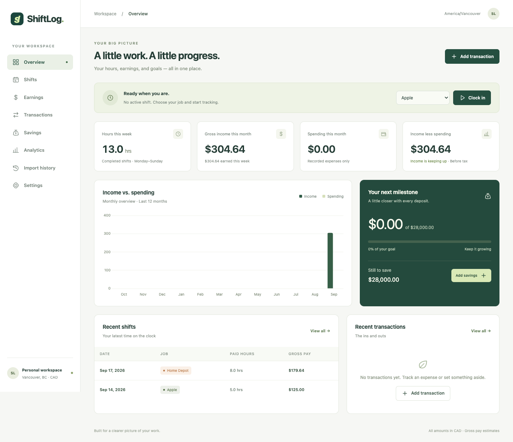
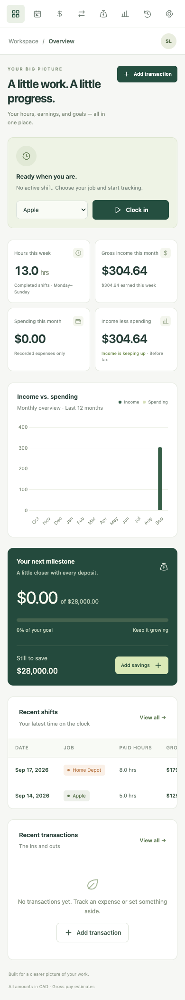

# ShiftLog

A personal dashboard for tracking work across multiple jobs, understanding gross earnings, recording spending, and working toward a savings goal. Built with Express, PostgreSQL, and vanilla JavaScript for a BCIT CST portfolio.

## Features

- Responsive dashboard with weekly hours, weekly/monthly gross income, monthly expenses, income less spending, recent activity, and savings progress.
- Clock in/out with live elapsed time, one active shift at a time, and server-side overlap protection.
- Manual shift creation, editing, confirmed deletion, and job/date/week/month filters.
- Overnight pay calculations, unpaid breaks, configurable premium windows, and date-effective pay rates.
- Expense and savings-deposit CRUD, category/type/date filters, and an editable savings goal (initially $28,000).
- Chart.js income-versus-spending, cumulative savings, and all-time hours/earnings by job, with accessible data tables and text summaries.
- Historical schedule preview and selective import. Existing/conflicting shifts are skipped; repeated and concurrent imports do not duplicate shifts.
- Vancouver timezone handling with bundled IANA timezone data; no manual fixed-offset subtraction.
- Automated calculation, real PostgreSQL API, and desktop/mobile browser tests.

## Screenshots

Desktop overview with sample shifts:



Mobile overview:



## Tech stack

HTML, compiled Tailwind CSS and custom component CSS, vanilla JavaScript ES modules, Chart.js, Node.js 22+, Express 5, PostgreSQL, `pg`, and `dotenv`. Moment Timezone supplies the same named-zone rules to Node and the browser. Playwright is development-only browser test tooling. No frontend framework or ORM.

Tailwind and Chart.js follow their official [CLI](https://tailwindcss.com/docs/installation/tailwind-cli) and [integration](https://www.chartjs.org/docs/latest/getting-started/integration) documentation. Scripts, fonts, styles, and chart dependencies are served locally; the app does not require a CDN.

## Architecture

```text
Browser: public/index.html + public/js modules
              │ fetch /api/* (JSON)
              ▼
server.js → routes/api.js → validation / calculations / summaries
              │ parameterized pg queries
              ▼
PostgreSQL: jobs, shifts, pay_rates, transactions, savings_goals
```

`server.js` configures Express, static assets, response headers, same-origin browser write checks, routes, and error handling. `db.js` exports the PostgreSQL connection pool. The existing jobs/shifts routes and tables are extended in place. `lib/pay.js` owns earnings logic; the frontend displays server-calculated results.

## Database design

| Table               | Purpose / relationship                                                          |
| ------------------- | ------------------------------------------------------------------------------- |
| `jobs`              | Employer identity and original wage field, preserved from the existing app      |
| `shifts`            | Actual instants, unpaid break, optional exact break start; FK to jobs           |
| `pay_rates`         | Authoritative date-effective base/premium rules; FK to jobs                     |
| `transactions`      | Positive expense or savings deposit, local calendar date, category, description |
| `savings_goals`     | Singleton personal goal                                                         |
| `schema_migrations` | Applied migration versions                                                      |

The migration preserves existing jobs/shifts, changes legacy timestamp-without-timezone columns to `TIMESTAMPTZ` **assuming the old values are Vancouver wall times**, and normalizes null break minutes to zero. It adds indexes, checks, a partial unique index for one active shift, and unique import keys. A migration conflict rolls back; no existing shifts are deleted. Back up before migrating a different database, and review the timestamp assumption if its legacy data came from somewhere else.

The original `jobs.hourly_wage` is kept for compatibility. All earnings after migration use `pay_rates`, which Settings manages. Initial rates inherit existing job wages; Home Depot starts with a $22.72 premium rate.

## Local installation

Requirements: Node.js 22 or newer, npm, a running PostgreSQL server, and a PostgreSQL role allowed to connect/create tables.

```sh
npm ci
cp .env.example .env
# Only if the database does not already exist:
createdb shiftlog
npm run migrate
npm run build
npm start
```

Open **http://127.0.0.1:3000**. For an existing database, skip `createdb`. The migration runner is transactional and safe to rerun. No historical work or transactions are imported automatically.

If PostgreSQL needs credentials, set `DATABASE_URL` in `.env`. If the database service is stopped, start it using your PostgreSQL installation's service manager. Do not commit `.env` or database backups.

### Environment variables

| Variable                 | Default / purpose                                                                     |
| ------------------------ | ------------------------------------------------------------------------------------- |
| `DATABASE_URL`           | Optional; otherwise local database `shiftlog` and normal pg/OS-user defaults          |
| `PORT`                   | `3000`                                                                                |
| `HOST`                   | `127.0.0.1`; use `0.0.0.0` in a hosted container                                      |
| `PGSSLMODE`              | Optional provider-specific TLS mode; use the provider's verified TLS/CA configuration |
| `TEST_DATABASE_URL`      | Separate test database; database name must end in `_test`                             |
| `PLAYWRIGHT_CHROME_PATH` | Optional path to an existing Chrome executable for browser tests                      |

Standard pg connection variables such as `PGHOST`, `PGUSER`, and `PGPASSWORD` also work. No TLS certificate-verification bypass is included.

### Commands

| Command                                   | Purpose                                                                   |
| ----------------------------------------- | ------------------------------------------------------------------------- |
| `npm start`                               | Run Express                                                               |
| `npm run dev`                             | Restart Node when backend files change                                    |
| `npm run build`                           | Compile and minify Tailwind/component CSS                                 |
| `npm run format` / `npm run format:check` | Format source / check formatting                                          |
| `npm run css:watch`                       | Rebuild CSS while editing frontend files (second terminal)                |
| `npm run migrate`                         | Apply pending SQL migrations                                              |
| `npm test`                                | Calculation, validation, schedule, and timezone tests, no database needed |
| `npm run test:integration`                | Real API tests in a disposable PostgreSQL schema                          |
| `npm run test:e2e`                        | Chrome/Chromium desktop and mobile browser workflows                      |

Compiled `public/css/app.css` is included, so `npm start` works without a live CSS compiler. Rebuild after changing class names or styles.

## API overview

All endpoints use `/api`. Writes accept `Content-Type: application/json`. Responses are JSON, except successful DELETE returns `204`. Errors use `{ "error": "Useful message" }` with `400`, `404`, `409`, `415`, or `500` as appropriate.

| Method / route                                         | Action                                                               |
| ------------------------------------------------------ | -------------------------------------------------------------------- |
| `GET /jobs`                                            | List jobs                                                            |
| `GET /shifts?job_id=&from=&to=`                        | Joined shifts with paid hours, gross, rate breakdown, break method   |
| `POST /shifts`                                         | Create a manual shift                                                |
| `PATCH /shifts/:id`                                    | Edit fields; omitted fields retain old values                        |
| `DELETE /shifts/:id`                                   | Delete a shift                                                       |
| `POST /clock-in`                                       | `{ "job_id": 1 }`; server supplies current time                      |
| `PATCH /shifts/:id/clock-out`                          | Complete an active shift with break minutes and optional break start |
| `GET /transactions?type=&category=&from=&to=`          | Filter transactions                                                  |
| `POST /transactions`                                   | Add expense or savings deposit                                       |
| `PATCH /transactions/:id` / `DELETE /transactions/:id` | Edit/delete transaction                                              |
| `GET /savings-goal` / `PUT /savings-goal`              | Read/update `{ "amount": 28000 }`                                    |
| `GET /dashboard`                                       | Summary, recent activity, chart data, payroll availability           |
| `GET /analytics`                                       | Twelve monthly aggregates and all-time totals by job                 |
| `GET /pay-rates` / `PUT /pay-rates`                    | Read/upsert job rules by effective date                              |
| `POST /history/preview`                                | `{ "from": "2026-01-01", "to": "2026-01-31" }`                       |
| `POST /history/import`                                 | Same range plus selected `keys` returned by preview                  |

A manual shift example:

```json
{
  "job_id": 2,
  "clock_in": "2026-09-17T21:00",
  "clock_out": "2026-09-18T05:30",
  "break_minutes": 30,
  "break_start": "2026-09-18T01:00"
}
```

Local datetime strings are interpreted in Vancouver. Explicit ISO offsets or `Z` are accepted as exact instants. API shift timestamps are serialized as UTC; the browser renders Vancouver time. `from` and `to` are inclusive local dates and shift filters use the clock-in date. Future shifts/transactions, overlapping shifts, invalid breaks, and completed shifts longer than 48 hours are rejected. Open shifts have no realized hours/pay until completed.

## Earnings calculations

1. Compute elapsed time between clock-in and clock-out instants; the clock-out date must explicitly be the next day for overnight work.
2. Divide the interval at minute boundaries. For each segment, resolve its Vancouver local date/time, the latest effective rule, and whether it falls in the premium window.
3. Subtract the exact unpaid break overlap when a break start is recorded. Otherwise distribute break minutes proportionally across all rates. This is an **estimate**, not a claim about when lunch occurred.
4. Multiply paid time by the configured rate in cents; round the final shift total to the nearest cent. Sum rounded shift totals for reporting.

Apple initially pays $25/hour. Home Depot initially pays $20.47 base and $22.72 premium. Its confirmed **10 PM–5:30 AM** premium window is configurable. The premium wraps midnight. Rule changes can apply during a shift, including effective dates at midnight.

Examples:

- Apple 8 AM–1 PM, no break: 5 paid hours, **$125.00**.
- Apple 10 AM–7 PM, 60-minute break: 8 paid hours, **$200.00**.
- Home Depot 9 PM–5:30 AM, 30-minute break with no timing: 8 paid hours, **$179.64** using proportional allocation.
- Same Home Depot shift with a break at 1 AM: 1 base hour + 7 premium hours, **$179.51**.

Weekly/monthly totals attribute the **entire shift to its Vancouver clock-in date**, including shifts crossing a reporting boundary. Weeks start Monday. Income less spending is before tax and is not treated as savings. Savings progress is the sum of recorded savings deposits divided by the goal; the percentage may exceed 100%, while the progress bar caps at 100% and remaining savings floors at zero.

## Historical imports

Open **Import history**, preview a range, then select the dates actually worked. Preview initially selects nothing. “Select available” is an explicit bulk selection, followed by a confirmation dialog. Imported shifts are labeled **Schedule estimate**.

- Home Depot Jan–Apr 2026: Monday, Thursday, Saturday, 9 PM–5:30 AM, 30-minute break.
- May 1–Sep 7: Home Depot Monday–Thursday and Saturday; Apple Monday, Friday, Saturday, Sunday, plus Thursday.
- Sep 8 onward: Home Depot Thursday/Saturday; Apple Monday/Friday/Saturday/Sunday.
- Apple shifts use the configured weekday/weekend schedule and unpaid lunch durations.
- No January–April Apple shifts are inferred. Occasional Apple Tuesdays, sick days, holidays, vacations, and other exceptions are not invented. Enter known Tuesday dates manually.
- Future/unfinished shifts are omitted. Existing start times, overlapping shifts, and durable import keys prevent duplicates. Editing an imported shift retains its import key. Deleting it deliberately allows that schedule date to be imported again.

## Testing

```sh
npm test
createdb shiftlog_test  # once; never point tests at your personal database
TEST_DATABASE_URL=postgresql://localhost/shiftlog_test npm run test:integration
npx playwright install chromium
TEST_DATABASE_URL=postgresql://localhost/shiftlog_test npm run test:e2e
```

Alternatively set `PLAYWRIGHT_CHROME_PATH` to a local Chrome executable. Tests create uniquely named schemas and drop only those schemas on completion. The dedicated database must have a name ending in `_test`. Browser tests cover navigation, modal forms, confirmed deletion/cancellation, live clock, savings goals, history import, error/retry states, and mobile document overflow. API tests also exercise concurrent writes and idempotent imports. See [verification notes](docs/VERIFICATION.md).

## Deployment

Build with `npm ci && npm run build`, configure the host's secret `DATABASE_URL`, `HOST=0.0.0.0`, and port, run `npm run migrate` once as a release step, then run `npm start`. Serve over HTTPS using the hosting platform/reverse proxy and use its recommended PostgreSQL TLS configuration. The browser and API must share an origin. The SQL timestamp conversion relies on database timezone data when converting old rows; keep the PostgreSQL installation current.

This version intentionally has **no authentication** and is bound to localhost by default. For a public portfolio, deploy only a disposable synthetic dataset behind access controls, or implement user authentication/ownership first. Do not publicly expose your real financial database. Deployment is configured separately from local installation.

## Known limitations

- Gross pay estimates only. Net pay is explicitly unavailable: federal/BC tax, CPP, EI, overtime, statutory holiday premiums, and employer contributions are not implemented. `lib/payroll.js` provides the future extension boundary; no tax rates are invented.
- Proportional unpaid breaks are estimates unless their start is recorded. Historical imports are schedule-based estimates until reviewed.
- One personal workspace. No authentication, job creation UI, multiple savings goals, savings withdrawals, or CSV import/export yet.
- Pay rules recalculate applicable history; they are not immutable payroll snapshots. The original jobs wage column is not the authoritative pay engine after migration.
- Summaries read all personal records and calculate earnings in Node. Appropriate for a personal portfolio; larger datasets need pagination, indexed range queries, and cached aggregations.
- A configured premium window is interpreted per local calendar day, not as an employer-specific payroll contract. DST transitions use real elapsed time, which can differ from scheduled wall-clock hours.
- The 1970–2030 browser timezone bundle and full server bundle are pinned by the lockfile. Refresh timezone data before tracking beyond 2030 or after future rule changes. The installed data includes B.C.'s 2026 permanent daylight-time change ([official province notice](https://www2.gov.bc.ca/gov/content/governments/celebrating-british-columbia/daylight-saving-time)).

## Co-op version scope

The co-op version includes gross earnings, multiple jobs, different pay rates, clock-in/out, shift tracking, spending, savings, dashboard, analytics, and historical import. Canadian tax calculations, overtime, employer contributions, and authentication are intentionally outside this version’s scope.

## Future improvements

User authentication with per-user ownership, CSV export/import, exact payroll snapshots, verified payroll estimates, overtime/holiday rules, savings withdrawals, multi-goal budgeting, and efficient aggregate caching.

## What I learned

The project demonstrates connecting Express to PostgreSQL without an ORM, separating business logic from HTTP/UI code, validating untrusted input, calculating overnight work across timezones, using transaction locks and database constraints together, building accessible vanilla-JavaScript forms, and testing against a real database without changing personal records.

[PROJECT_WALKTHROUGH.md](docs/PROJECT_WALKTHROUGH.md) explains the implementation and request lifecycle. [INTERVIEW_NOTES.md](docs/INTERVIEW_NOTES.md) summarizes the architecture, design decisions, and tradeoffs.
